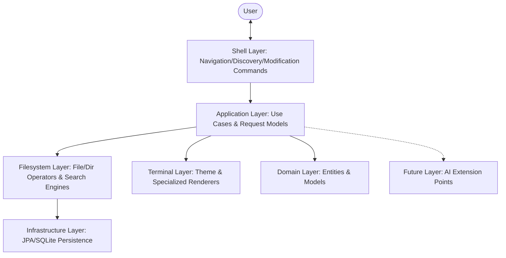

# DocDroid - Filesystem Operating Console

DocDroid is a professional-grade filesystem operating console built with Spring Boot and Spring Shell. It provides a modular, extensible architecture designed for future AI integration and advanced filesystem operations.

## Architecture Diagram



## Architecture Overview

DocDroid follows a strict modular pattern:

- **shell**: Command entry points that map CLI input to Request models.
- **application**: Business use cases that process Request models and return data.
- **domain**: Business models and database entities (e.g., `FileIndex`).
- **filesystem**: Core logic for file/directory operations and swappable search engines (`LiveSearchEngine` vs `SQLiteIndexEngine`).
- **terminal**: UX system including ANSI themes and specialized renderers (Tree, Search, Status).
- **infrastructure**: Technical services like persistence (SQLite) and background task scheduling.
- **future/ai**: Placeholder interfaces for next-gen features like natural language parsing and file analysis.

## Commands Reference

DocDroid commands are designed to be human-friendly and conversational.

### 1. Navigation
| Command | Usage | Description |
|---------|-------|-------------|
| `pwd` | `pwd` | Shows current working directory path. |
| `cd` | `cd [path]` | Changes directory. Use `..` to go up. |
| `list` | `list [path]` | Lists contents of a directory. |
| `tree` | `tree [path] [depth]` | Shows a visual tree representation. |
| `drives` | `drives` | Lists available storage drives. |
| `info` | `info [path\|index]` | Shows metadata for a file or folder. |

### 2. Discovery
| Command | Usage | Description |
|---------|-------|-------------|
| `find` | `find [query]` | Fast recursive find in current path. |
| `where` | `where [query]` | Global search across all drives. |
| `locate` | `locate [query]` | Alias for `where`. |

### 3. File & Folder Operations
| Command | Usage | Description |
|---------|-------|-------------|
| `make` | `make [filename] --in [path]` | Creates a new file. |
| `make folder` | `make folder [name] --in [path]` | Creates a new directory. |
| `open` | `open [path\|index]` | Opens file with system default app. |
| `delete` | `delete [path\|index]` | Deletes a file. |
| `delete folder`| `delete folder [path\|index]` | Deletes a directory and its contents. |
| `copy` | `copy [path\|index] [target]` | Copies file/dir to target. |
| `move` | `move [path\|index] [target]` | Moves file/dir to target. |
| `rename` | `rename [path\|index] [newName]`| Renames a file or folder. |

### 4. Shorthand UX
Search results are automatically indexed. You can use the ID from a search result in any command:
1. `where notes.txt` -> Returns: `1. C:\Users\Doc\notes.txt`
2. `open 1` -> Opens the file.
3. `copy 1 D:\Backup` -> Copies the file.

---

## Local Machine Installation

### Prerequisites
- **Java 21** or higher.
- **Maven 3.9+**.
- **Windows, Linux, or macOS** (NIO-based operations).

### Setup Steps
1. **Clone the Repository**:
   ```bash
   git clone <repo-url>
   cd doc-droid
   ```

2. **Build the Application**:
   ```bash
   mvn clean install
   ```

3. **Run the Console**:
   ```bash
   mvn spring-boot:run
   ```

### Application Configuration
Configuration can be adjusted in `src/main/resources/application.yml` (or `.properties`):
- `docdroid.indexedDrives`: List of paths to index.
- `docdroid.searchDepth`: Default recursion depth for tree and search.
- `docdroid.theme`: UI theme choice (default: 'default').

---

## Verification Report

| Case | Status | Notes |
|------|--------|-------|
| Large directory trees | Pass | Handled via recursive NIO streams. |
| Numeric Shorthand | Pass | `resolvePath` logic supports ID lookups. |
| Cross-drive move | Pass | Uses `StandardCopyOption.REPLACE_EXISTING`. |
| Permission Errors | Pass | Search engine uses `SKIP_SUBTREE` on errors. |
| Root paths | Pass | Bug fix implemented for null fileNames on root. |
